# ⭐ Start--up - Connecting Entrepreneurs with Investors

<div align="center">
   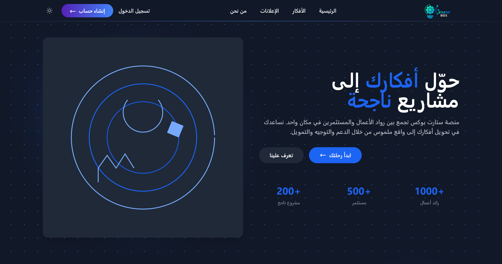

---

<div align="center">
  Made with ❤️ by Ahmed Alsanadi
  
  © 2025 All Rights Reserved
</div>


  
  
  
  
</div>

---

## 📚 Table of Contents

* [✨ Overview](#-overview)
* [✨ Features](#-features)
* [🎨 Screenshots Showcase](#-screenshots-showcase)
* [🛠 Technologies](#-technologies)
* [📁 Project Structure](#-project-structure)
* [📦 System Requirements](#-system-requirements)
* [🔒 Security](#-security)
* [📜 License](#-license)
* [💬 Support](#-support)

---

## ✨ Overview

**StartBox** is a modern platform connecting innovative entrepreneurs with active investors. Whether you're pitching an idea or funding the next big thing, StartBox delivers a seamless, secure, and interactive experience—supporting both light and dark modes.

<div align="center">
<td align="center">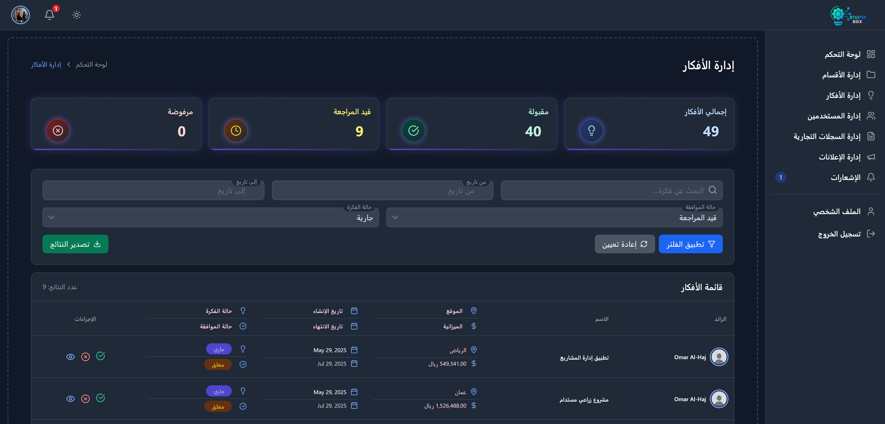<br/><strong>Admin Dashboard</strong></td>
</div>

---

## ✨ Features

<div align="center">

| 💼 Investors             | 💡 Entrepreneurs           | ⚙️ Admin Panel               |
| ------------------------ | -------------------------- | ---------------------------- |
| ✅ Create & manage ads    | ✅ Submit startup ideas     | ✅ User/Idea moderation       |
| 🔍 Browse & filter ideas | 🔔 Receive feedback        | 📊 Analytics & reports       |
| 📈 Portfolio dashboard   | 📤 Update project progress | 📁 Smart category management |
| 🔒 Verify applicants     | 📚 Idea archive            | 🔐 Access control (RBAC)     |

</div>

---

## 🎨 Screenshots Showcase

<div align="center">

### 🌙 Dark Mode

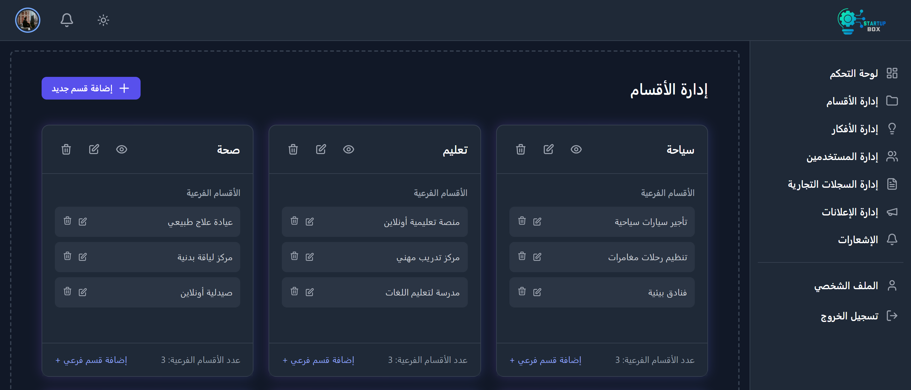

### 🌞 Light Mode

   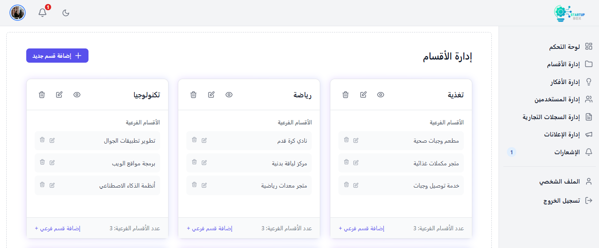

### Announcement
  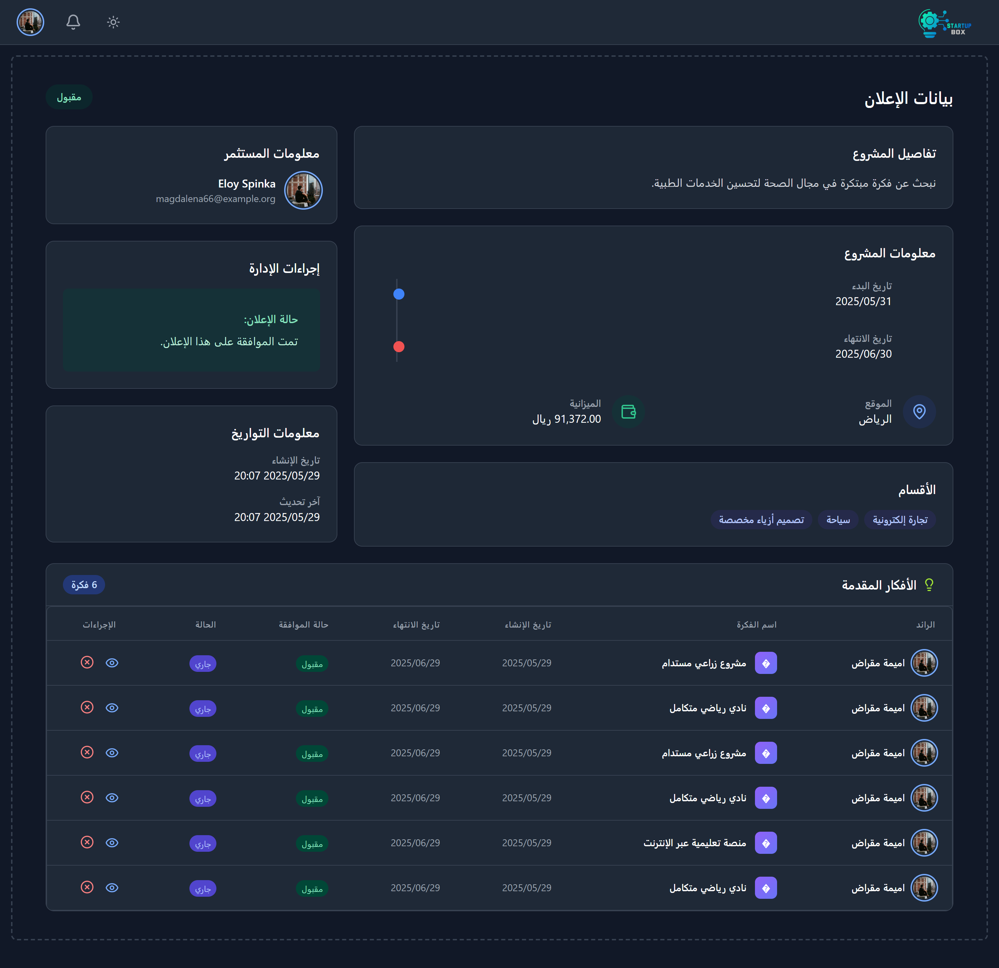

</div>

---

### Additional Images
<details>
<summary>Click to expand and explore the visual beauty</summary>

### 💼 Manage Announcements
<div align="center">
  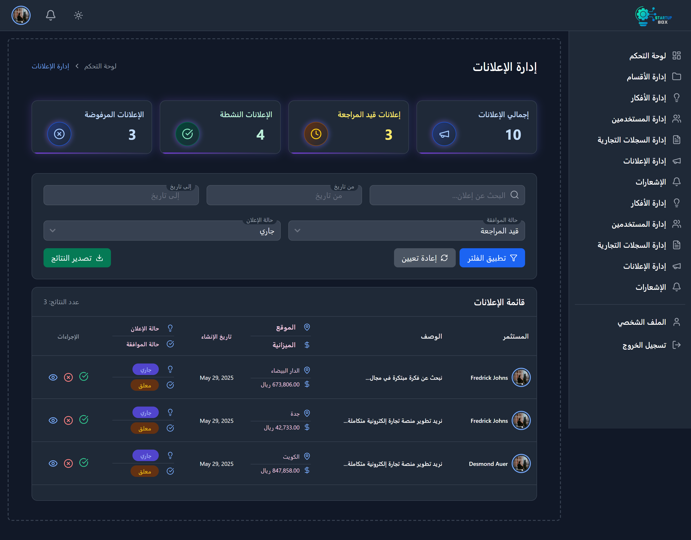
  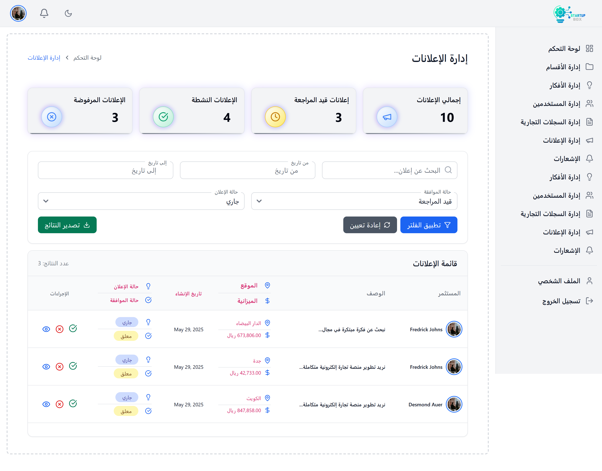
</div>

### ✅ Manage Ideas
<div align="center">
  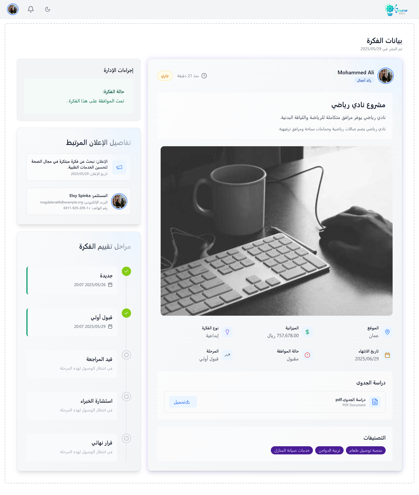
  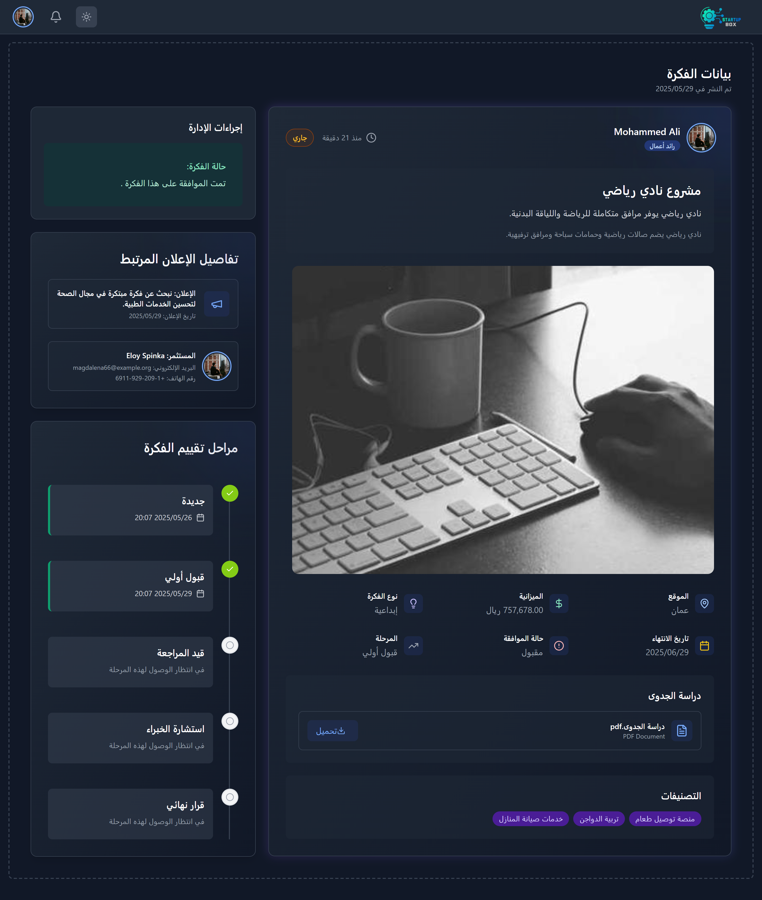
</div>

### Additonal
<div align="center">
  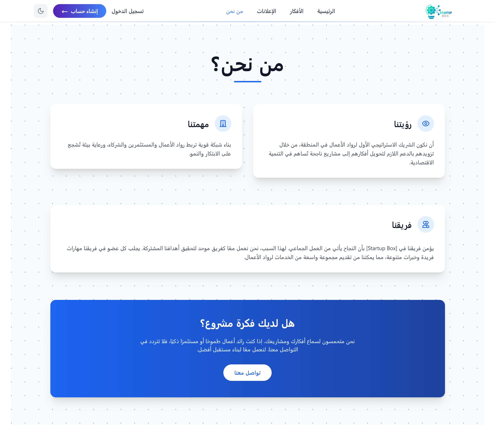
  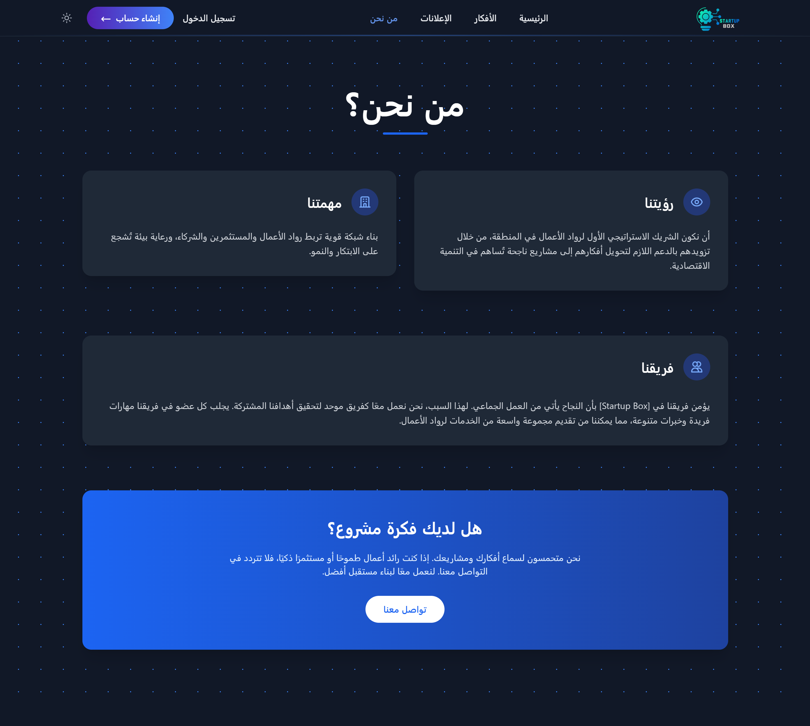
</div>

<div align="center">
  
</div>

</details>

---

## 🛠 Technologies

<div align="center">

| Backend Stack | Frontend Stack    |
| ------------- | ---------------- |
| Laravel 12.x  | TailwindCSS      |
| PHP 8.3       | Modern UI/UX     |
| MySQL 8.x     | Responsive Design|

</div>

---

## 📁 Project Structure

```bash
backend/
├── app/
│   ├── Http/Controllers/    # Controllers
│   ├── Models/              # Eloquent Models
│   ├── Services/            # Business Logic
│   └── Notifications/       # System Notifications
├── resources/
│   ├── views/               # Blade Views
│   ├── css/                 # Tailwind Styles
│   └── js/                  # Alpine Scripts
├── routes/                  # Web/API Routes
├── database/                # Migrations & Seeds
└── tests/                   # PHPUnit Tests
```

---

## 📦 System Requirements

For authorized deployment:

* PHP >= 8.3
* MySQL 8.0 or higher
* Modern web browser
* Secure hosting environment

---

## 🔒 Security

* 🔐 Verified commercial registrations
* 🛡️ Enterprise-grade security measures
* 🔑 Role-based Access Control (RBAC)
* 🔒 Data encryption for sensitive information

---

## 📜 License

This project is proprietary software owned by Ahmed Alsanadi. All rights reserved.

**PROPRIETARY SOFTWARE - NO UNAUTHORIZED USE**

This software and its documentation are proprietary and confidential. No part of this software may be reproduced, distributed, or transmitted in any form or by any means without explicit written permission from the copyright holder.

For permission requests or inquiries:
* 📧 Contact: Ahmed Alsanadi (Copyright Holder)
* 🔗 Project: [Start--up](https://github.com/ahmedalsanadi/start--up)

---

## 💬 Support

Need help or have questions?

* 📧 Email: [ahmed11alsanadi11@gmail.com](mailto:ahmed11alsanadi11@gmail.com)
* 💬 GitHub Issues: [Open an issue](https://github.com/ahmedalsanadi/start--up/issues)

---

<div align="center">
  <strong>Start--up © 2025 Ahmed Alsanadi</strong> • All Rights Reserved  
  <br/>
  <br/>
  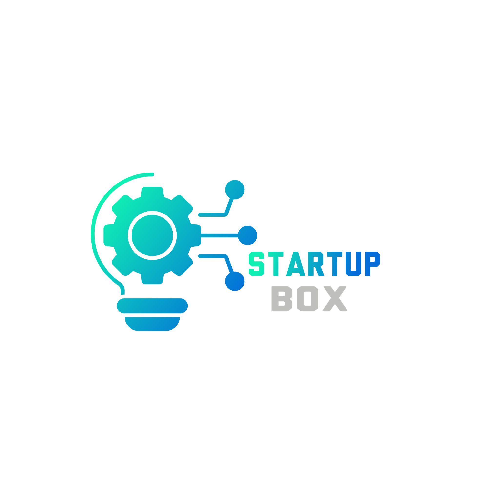
</div>
